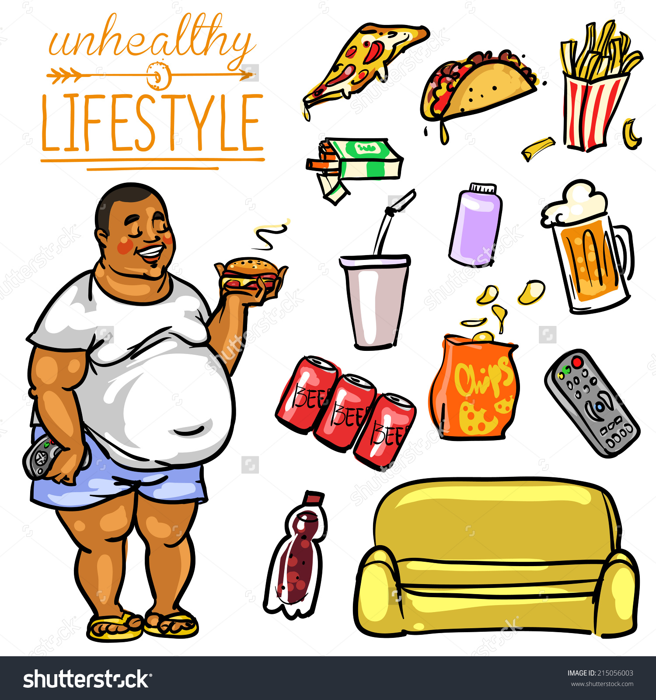

<style type="text/css">
h1.title {
  font-size: 27px;
  color: Grey;
}
h4.author{
  color:Grey;
  margin-bottom: 40px;
}
h1.naslov{
  font-size: 50px;
  margin-bottom: 20px;
}

</style>

```{r setup, echo=FALSE, results='hide', message=FALSE, warning=FALSE}
# Če želimo nastaviti pisave v PDF-ju, odkomentiramo
# in sledimo navodilom v programu.
#source("fontconfig.r", encoding="UTF-8")

# Uvoz vseh potrebnih knjižnic
source("lib/libraries.r", encoding="UTF-8")
```

```{r rstudio, echo=FALSE, results='asis'}
# Izris povezave do RStudia na Binderju
source("lib/rstudio.r", encoding="UTF-8")
```

<center> <h1 class="naslov">ANALIZA NEZDRAVEGA ŽIVLJENSKEGA SLOGA</h1> </center>

<center class="slika">

{width=400px}
</center>
# Izbira teme

V projektu bom analizirala nezdravi način življenja ljudi po posameznih državah v Evropi in pogledala ali je kakšna povezava s BDP na prebivalca. Zanimalo me bo tudi ali ima na nezdravi življenjski slog kakšen vpliv izobrazba in spol. Osredotočila se bom na naslednje determinante zdravja: povišano telesno težo, pitje alkohola, kajenje, telesno aktivnost in dnevno zauživanje sadja ali zelenjave.


***

# Obdelava, uvoz in čiščenje podatkov

```{r uvoz, echo=FALSE, message=FALSE}
source("uvoz/uvoz.r", encoding="UTF-8")
```

Uvozila sem podatke glede na države, izobrazbo in spol v obliki CSV s Eurostata. Podatke imam v dveh razpredelnicah v obliki *tidy data*.
V prvi tabeli so predstavljeni podatki glede na države, v drugi tabeli pa glede na izobrazbo in spol. Obe tabeli imata naslednje stolpce enake in sicer:

**tabela** - podatki v tabelah so

  * `s povisano telesno tezo` - meritev: procent ljudi s povišano telesno težo (število)
  * `0 obrokov sadja in zelenjave` - meritev: procent ljudi, ki ne zaužijejo nič sadja in zelenjave na dan(število)
  * `5+ obrokov sadja in zelenjave`- meritev: procent ljudi, ki pojejo 5+ sadja in zelenjave na dan (število)
  * `1-4 obrokov sadja in zelenjave`- meritev procent ljudi, ki pojejo 1-4 obroke sadja in zelenjave na dan (število)   
  * `dnevni kadilci`- meritev : procent dnevnih kadilcev (število)
  * `tedensko prekomerno pijancevanje`- meritev: procent ljudi, ki tedensko prekomerno pijančujejo (število)
  * `mesecno prekomerno pijancevanje` - meritev: procent ljudi, ki vsak mesec prekomerno pijančujejo (število)
  * `vec kot 150 min telesno aktivni` - meritev: procent ljudi, ki namenijo več kot 150 min na teden športu (število)
  * `do 150min telesno aktivni` - meritev: procent ljudi, ki so do 150min telesno aktivni na teden (število)
  * `niso telesno aktivni`- meritev: procent ljudi, tedensko ne namenijo nič časa športnim aktivnostim (število)
  
  Tabeli se razlikujeta glede na vrsti meritve tako, da je razlika v dveh stolpcih in sicer v tabeli s državami sta poleg naštetih tudi:
  
  * `države` - spremenljivka: ime države(besedilo)
  * `BDP per capita(US$)`- meritev bruto domačega proizvoda na prebivalca (število)
  
  V drugi tabeli, kjer so meritve glede na izobrazbo in spol pa:
  
  * `izobrazba`- spremenljivka: stopnja izobrazbe(besedilo)
  * `spol`- meritev: vrsta spola(besedilo)
  
```{r tabela_drzav,echo=FALSE, message=FALSE}
#summary(tabela_drzav[c(1,2,3)])
kable(head(tabela_drzav[c(1,2,3,4,5)]))
kable(head(tabela_izobrazbe_spol[c(1,2,3,4,5,6)]),align="c")
```

***

# Analiza in vizualizacija podatkov
```{r vizualizacija, echo=FALSE, message=FALSE, warning=FALSE, results='hide'}
source("vizualizacija/vizualizacija.r", encoding="UTF-8")

```

Graf 6 držav- 3 z najvišjim BDP(Luxemburg,Norveška in Danska) in 3 z najnižjim (Bolgarija, Romanija, Turčija)
Vsaka točka ima svoj pomen in sicer:

 - `rdeča` - prikazuje procent dnevnih kadilcev
 - `zelena` - delež ljudi s povišano telesno težo
 - `oranžna` - procent ljudi, ki nič časa ne namenijo telesnim aktivnostim
 - `vijolična` - delež ljudi, ki ne zaužijejo nič obrokov sadja in zelenjave
 - `modra` - procent ljudi, ki mesečno prekomerno pijančuje

```{r graf_drzav_BDP, echo=FALSE, message=FALSE, warning=FALSE}
graf_drzav_BDP
```

V grafu opazimo, da je stopnja dnevnih kadilcev za države z nižjim BDP približno enkrat višja od razvitejših držav. 
Delež ljudi s povišano telesno težo se giblje okrog 50 %, vendar za države z višjim BDP velja, da je delež pod 50 %, za države z nižjim BDP pa nad 50%. 
Največja razlika se pokaže v namenjanju časa športnim aktivnostim.  Procent ljudi, ki se ne ukvarjajo s športom  v razvitejših  državah je krepko pod 50%, v manj razvitih pa krepko nad 50 %.
Glede pijančevanja in zauživanja sadja in zelenjave pa ni vidnih povezav z BDP na prebivalca.
Natančnejšo analizo sem naredila z naslednjim grafom. Zanimalo me je ali obstaja torej korelacija med BDP in ostalimi meritvami.


```{r corr, echo=FALSE, message=FALSE, warning=FALSE}
corrplot(corr, method = "number", title = "Korelacija med meritvami",,mar = c(0,0,1,0))

```

Izkaže se, da ima BDP na prebivalca največji vpliv na delež dnevnih kadilcev, takoj za tem pa na povečanje telesnih aktivnosti. Veliko obratno soodvisnost ima tudi na procent prebivalstva s povišano telesno težo. Najbolj pa me preseneča podatek korelacije z uživanjem alkohola, vendar mislim, da razlog bolj povezan s podnebjem in verami držav. Opazimo pa tudi veliko povezavo med deležem prebivalca, ki niso aktivni ter kadilci.

Naslednji grafi prikazujejo kako izobrazba in spol vplivata na različne dejavnike.

```{r g_kajenja_debelosti, out.width = "50%", echo=FALSE, message=FALSE, warning=FALSE}
g_debelosti
g_pijancevanje
```
Medtem ko za ženske velja, da z višjo stopnjo izobrazbe pada procent žensk s povišano telesno težo, za moške pa to ne drži.
Kar se tiče pitja alkohola ni vidnih povezav, sklepam, da je to zaradi drugih pomembnejših dejavnikov.

```{r g_pijancevanja_sz, out.width = "50%", echo=FALSE, message=FALSE, warning=FALSE}

g_nic_sz
g_kajenja
```
V obeh grafih je za prebivalce s sekundarno stopnjo izobrazbe delež največji. Torej ne drži, da z višanjem izobrazbe se delež dnevnih kadilcev oz. vnos sadja in zelenjave znižuje. Opazimo pa, da je delež za ljudi s terciarno stopnjo izobrazbe najmanjši.

```{r g_niso_aktivni,out.width = "50%", echo=FALSE, message=FALSE, warning=FALSE}
g_niso_aktivni
```

Najbolj je vidna povezanost med stopnjo izobrazbo in neaktivnim prebivalstvom.  Za ljudi s primarno stopnjo izobrazbo je delež neaktivnega prebivalstva kar 61,8 %in se zmanjša na 34%  za prebivalstvo z najvišjo stopnjo izobrazbe.

```{r shiny, echo=FALSE}
shinyAppDir("shiny", options=list(width="100%", height= 700))
```

# Zaključek

V analizi sem ugotovila, da razvitost države ima največji vpliv na delež dnevnih kadilcev, ki z razvitostjo pada.  Prav tako velja, da z višanjem stopnje izobrazbe in razvitosti države je  manj ljudi telesno neaktivnih in s povišano telesno težo. Vpliv na ostale determinante zdravja iz analize niso vidne. 
